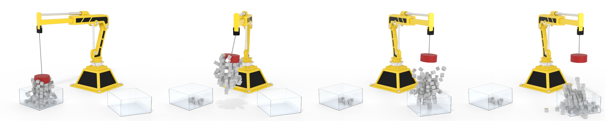
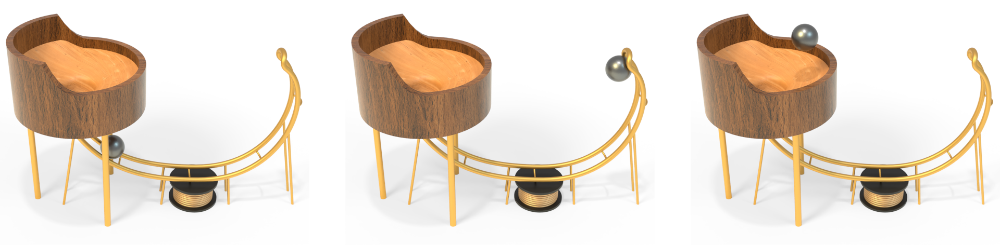

# Reference Implementation of "Strongly Coupled Simulation of Magnetic Rigid Bodies" in Stark

<p>
 
</p>

This repository provides a reference implementation of the publication "Strongly Coupled Simulation of Magnetic Rigid Bodies" by Westhofen et al.:

> L. Westhofen, J. A. Fernández-Fernández, S. R. Jeske, and J. Bender. 2024. Strongly Coupled Simulation of Magnetic Rigid Bodies. In Proceedings of the ACM SIGGRAPH/Eurographics Symposium on Computer Animation (SCA '24). Eurographics Association, Goslar, DEU, 1–11. https://doi.org/10.1111/cgf.15185

Please refer to the [publication page](https://animation.rwth-aachen.de/publication/0590/) for more details. 
The implementation relies mainly on [Stark](https://github.com/InteractiveComputerGraphics/stark).
Please also check the upstream repository for further details on Stark.

<p>
 
</p>

# Building & Running

To build the repository, `cmake` is being used. 
The project builds in source using the following commands:

```bash
cmake -DCMAKE_BUILD_TYPE=Release .
make -j 12
```

To run the experiments shown in the paper, execute the binary created in the `examples` folder

```bash
cd examples
./examples
```

If left unmodified, this will execute all experiments of the paper consecutively. 
Their respective outputs can be found in the `output` folder.

# Compatibility

The code has been tested and compiled with:

- Debian 12 64-bit, CMake 3.25.1, GCC 12.2.0

# License 

As a fork of Stark, the main library entailing all folders except `models` are licensed under the Apache-2.0 license in accordance with Stark itself.
See the `LICENSE` file for more details.

The `Armadillo.obj`, `Dragon.obj` and `Bunny.obj` in `models` are variations of the Stanford Armadillo, Dragon & Bunny, courtesy of the [Stanford Computer Graphics Laboratory](https://graphics.stanford.edu/data/3Dscanrep/).
